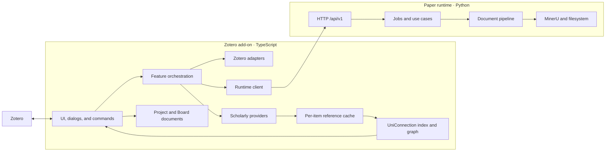

# Architecture

This document describes the architecture that exists now.

## System



Metadata, literature-relations, and graph features run entirely in the add-on. PDF
conversion, artifact publishing, and Markdown annotation injection require the local
runtime.

**Product surfaces (this branch):** the Obsidian plugin is the active note front end
(bridge under `src/server/`: GET data plane plus `POST /convert`). Unizero Home (Project View / Board) remains in
the add-on UI but is **legacy** — not the focus for new work. Item-pane previews and the
per-paper graph stay available; they are not the main roadmap.

## Add-on layers

| Layer | Current paths | Role |
| --- | --- | --- |
| Lifecycle | `src/hooks.ts`, `src/core/` | Register and clean up features per window |
| Features | `src/features/` | Commands and user-facing orchestration |
| UI | `src/ui/`, `src/modules/views.ts` | Menus, panes, dialogs, progress |
| Dialog content | `addon/chrome/content/` | Privileged XHTML windows: panel, Unizero Home, graph renderer |
| Zotero adapters | `src/zotero/` | Read and mutate Zotero items and attachments |
| Providers | `src/modules/*Api.ts`, `src/modules/resolve.ts` | Scholarly HTTP access and normalization |
| Cache | `src/modules/localStorage.ts`, `src/modules/literatureCache.ts` | Per-item shards under the add-on data directory |
| Derived index | `src/modules/uniConnection.ts`, `src/modules/uniConnectionSync.ts` | Reverse-reference index, coupling, graph topology |
| Projects | `src/projects/` | Portable Project identity, versioned Board/Paper shapes, local object persistence |
| Runtime boundary | `src/runtime-client/` | Contract types, HTTP, launch, process state |
| Editor boundary | `src/server/` | Bridge endpoints (GET + convert action) and citekey resolution |

`src/modules/` contains the established item-pane, metadata, provider, and cache
implementation. New code uses the more specific directories above. Existing modules are
split only when the work being done needs that boundary.

Feature IDs are statically registered in `src/core/features.ts`:

- `library.metadata`;
- `literature.relations`;
- `document.convert`;
- `annotations`.

Static registration keeps activation and cleanup auditable in Zotero's multi-window
environment. The derived index and Unizero Home belong to
`literature.relations`, which also owns the index's Zotero notifier registration.

## Project identity and persistence

Opening Unizero Home for a Zotero Collection ensures one stable Project and one default
Board. The subject is the portable personal/group library scope plus the Zotero Collection
key; numeric `libraryID` and `collectionID` remain local lookup values and are never
persisted as project identity. Renaming a Collection updates the display name only.

Project and Board are separate schema-versioned documents under
`<dataDir>/unizero/projects/`, and their local paths are not a sync protocol. Board nodes
and manual edges are independent documents, so moving a card or changing one connection
does not force a whole-board last-write-wins merge. Card geometry, edges, and tombstones
are persisted per object; the Board camera is transient window state and shares no
document with them. The same Paper may back more than one node, so edges and geometry
belong to node instances, not to Papers.

Board node schema 1 is a discriminated union: existing `kind: "paper"` documents remain
valid standalone-paper shorthand, while `kind: "text"` documents own an ordered block
array whose blocks carry stable IDs. Embedding copies no Paper metadata and creates no
Zotero item.

## Sync

Project documents sync through a backend-neutral engine using per-device manifests and
immutable packs. The WebDAV adapter owns only HTTPS, Basic authorization, collections, and
conditional requests. A process-wide scheduler runs after a delayed startup and then at a
user-selected interval of 30 minutes or longer; completion-based timers and the service's
in-flight promise prevent overlapping runs.

Three rules keep a device from being stranded or misreported:

- **A run that reports remaining work is a continuation, not a result.** One run transfers
  a bounded number of packs, so a large first sync spans several. The scheduler retries in
  seconds rather than waiting out the interval, a manual sync loops until nothing remains,
  and neither claims success mid-transfer.
- **An unknown namespace is skipped, never fatal.** A pack from a newer build may carry a
  namespace this one has not registered; throwing would stop that pack and every later one
  from applying, permanently stranding the device. The checkpoint records the skipped packs
  and the namespaces responsible, and a build that registers one replays exactly those.
- **Content addressing is locale-independent.** Everything a checksum or pack ID is
  computed over uses code-unit ordering and invariant case folding, so two devices in
  different locales agree on the identity of identical data.

The WebDAV application password is device-local secret state, stored in Firefox's Login
Manager under the WebDAV origin and an add-on-specific realm — Zotero's own credential
boundary, without reading or overwriting Zotero's WebDAV entry. URLs, usernames, schedule
preferences, and last-run diagnostics are ordinary local preferences. No credential enters
a typed document, pack, checkpoint, or log. Remote Project object IDs are validated as
bounded portable names both at the namespace boundary and again before repository path
construction.

## Paper catalog

The catalog is stored separately under `<dataDir>/unizero/literature/`. A Zotero binding
uses portable library scope plus item key, so refreshing metadata never replaces a Paper
ID. Dropping an out-of-library result creates or reuses an identifier-aliased Paper
without creating a Zotero item; a later Zotero-bound observation with a matching
identifier adds a binding to that same Paper instead of replacing its ID.

Loading a References or Citations snapshot materializes every result at `cache` retention,
whether or not it reaches the Board, and retention only ever climbs:

```text
cache → pinned → zotero
```

Reliable DOI, arXiv, Semantic Scholar, and OpenAlex aliases converge provider results. An
unidentified result gets a query-scoped provisional mapping keyed by bibliographic
fingerprint rather than by position in a provider's list, so reopening a saved snapshot
reuses its Paper — without title or author ever becoming a global merge key. Where an
alias set resolves to more than one Paper, identifier inspection reports the conflict
rather than silently picking one; an explicit merge chooses the canonical Paper, keeps its
Zotero binding as metadata owner, rewrites and deduplicates observations, and leaves a
`paper-redirect` so existing Board and future sync references stay valid.

The same snapshot writes `LiteratureCitationObservation` documents: References records
`seed → result`, Citations records `result → seed`, and provider, query kind, retrieval
time, and source order stay on the observation rather than being flattened into a
sourceless permanent fact. Repeated reads update the same observation and never move its
retrieval time backwards. Only a successful terminal snapshot may replace older
observations for the same seed, query kind, and provider — an incomplete page or a
provider failure never compacts prior evidence. After a replacement, cache-only Papers
with no remaining observation are collected; pinned and Zotero-bound Papers never are.

Board relation hints project `UniConnection` and catalog observation edges onto the Paper
IDs currently on the Board, querying the adjacency index with that set rather than
scanning every observation. They are recomputed data: they never create or update
manual-edge documents, and failing to derive them does not prevent the Project from
opening.

The Board's interaction surface is described in
[apps/zotero-addon/README.md](../apps/zotero-addon/README.md) and its design constraints in
[UNIZERO_HOME.md](UNIZERO_HOME.md).

## Derived relations index

`UniConnection` is a derived layer. It owns no truth: everything it holds is recomputed
from the per-item `References-Resolved-v4` caches and from item identifiers, so it can be
discarded and rebuilt at any time.

One reverse index answers every query it serves — the Relation tab, bibliographic
coupling, whole-library topology, and the Board's relation hints — so a change to how
edges are stored affects all four. Topology is memoized per library and invalidated by
build, ingest, retract, trash, and delete.

Rules this layer keeps:

- **Edges need a stable identity.** `edgeIdentity` yields `doi:` / `arxiv:` / `s2:` keys;
  a reference without one is skipped rather than keyed by title, which would silently
  merge distinct papers.
- **Topology carries no Zotero fields.** `GraphNode` holds `id`, `itemKey`, `degree`, and
  `isCenter` only. Titles, years, and citation counts are added afterwards by
  `views.getLiteratureGraph`, from the same source as the Collection snapshot. This keeps
  the index host-independent and unit-testable.
- **The index spans all edges, not just library members.** Two library papers can be
  coupled through a reference neither of them is. Library filtering happens at query
  time.
- **Bulk builds read shards directly**, bypassing the cache's small resident set, so a
  full-library scan cannot evict the interactive working set.
- **Maintenance is incremental.** `uniConnectionSync` registers a Zotero notifier;
  add/modify retracts and re-ingests an item, delete and trash retract it. Items without
  a reference cache are filled by a throttled, deduplicated queue that reuses
  `referencesApi` and its provider rate gate.
- **Reference writes are ordered before topology reads.** A References refresh awaits the
  cache write and `ingestItem` before the bridge resolves. Citations only update status,
  while Markdown conversion patches live node metadata without rebuilding topology.

The index has three consumers: the per-paper Relation tab, the Board's transient relation
hints, and the force-graph renderer. Design detail and the reasoning behind these
constraints are in [UNICONNECTION.md](UNICONNECTION.md).

## Board and graph rendering

Unizero Home is a privileged XHTML dialog, not part of the TypeScript bundle. It reaches
the add-on only through the plain-object API passed as `window.arguments[0]`.

`literature-explorer.js` owns the Board and the detail tabs; `literature-graph.js` owns
force simulation and canvas drawing and consumes only the plain `LiteratureGraph`
structure, so the renderer can be replaced without touching the data layer. Its one
surface is the per-paper Graph tab. The full-library Collection graph and the management
table that preceded the Board were deleted.

Four rules hold this dialog together. Breaking any of them produces a bug that is
expensive to trace back:

- **Every async result belongs to exactly one owner.** Papers open as tabs but share a
  single detail view in the DOM, so each operation captures its context generation, tab,
  item key, kind, and request generation, and may write only to that owner — and to the
  live DOM only while the owner is active. A context reload increments the generation and
  drops everything scoped to the old library.
- **Rendering the Board and interacting with it are separate.** A refresh landing
  mid-gesture defers its rebuild instead of replacing the DOM under the pointer; a rebuild
  would drop the caret out of a Text Node being typed into and detach the element a drag
  is following. The deferred render runs when the gesture ends.
- **Every callback handed to force-graph passes through `guard()`.** They run
  synchronously inside an animation loop with no error handling, so one unguarded throw
  stops rendering permanently.
- **Saved layout coordinates are valid only at the force scale that produced them.**
  `GRAPH_LAYOUT_VERSION` covers changes made in code and a force signature covers the
  user's own settings; either mismatch is a cold start.

The window's preview LRU is not a provider cache: it holds completed snapshots so a
Collection preview returning A → B → A does not rebuild A, and it never stands in for the
disk cache the providers write. Reasoning and the incidents behind the last two rules are
in [UNICONNECTION.md](UNICONNECTION.md).
`vendor/force-graph.min.js` is a vendored MIT build; dialog content is fully local, with
no CDN or external fetch. The `happy-dom` harness loads the real XHTML and plain
JavaScript and covers all four rules; privileged Zotero APIs and the real canvas remain
manual checks.

## Runtime layers

| Layer | Path | Role |
| --- | --- | --- |
| Transport | `api/` | Validate and map HTTP requests and responses |
| Application | `application/` | Configuration, job queue, conversion, annotations |
| Pipeline | `pipeline/` | Templates, step registry, transforms, publishing |
| Providers | `providers/` | Reference extraction, tables, remote enrichment |
| Composition | `composition.py` | Construct dependencies without import-time work |

The runtime keeps mutable state outside the installed package. `paths.py` resolves a
single runtime home containing configuration, work files, generated state, user
templates, and logs.

## Boundary

The add-on sends typed requests to `/api/v1`; the runtime returns typed responses and
capabilities. The shared field contract is
`packages/contracts/http/v1.schema.json`, mirrored by TypeScript and Pydantic models.

During conversion, `transform.references` reads MinerU's untouched content list before
Markdown cleanup removes the bibliography. The runtime returns ordered local extraction
records only (`raw`, page, printed DOI/arXiv); the add-on persists them in the owned,
versioned `ZoMiner References` JSON attachment. Provider matching, citation counts, and
library resolution remain add-on responsibilities.

Dependency direction:

```text
add-on UI → feature orchestration → Zotero/provider/runtime ports

add-on dialog content → window API bridge → views → cache/derived index

runtime API → application services → pipeline/providers → filesystem/MinerU
```

Neither component reaches through the HTTP boundary to reuse the other's implementation.

## Data ownership

| Data | Owner |
| --- | --- |
| Bibliographic fields and item relations | Zotero items |
| Project identity, Board objects and paper-node layout | Versioned Project documents |
| Stable library/external paper identity and Zotero bindings | UniZero Paper catalog |
| Object merge, local checkpoint, manifest, and pack semantics | Sync engine |
| HTTPS, Basic authorization, WebDAV collections, and ETags | WebDAV backend |
| Highlight and underline annotations | Zotero attachment annotations |
| Provider responses | Refreshable add-on cache, one shard per item |
| Reverse-reference index, coupling, graph topology | Derived from the reference cache; rebuildable, never authoritative |
| Graph layout coordinates | `<dataDir>/unizero/graph/<libraryID>.json`, versioned and discardable |
| Graph display and force settings | `<dataDir>/unizero/graph/settings.json`, one file for every library |
| Conversion templates and jobs | Paper runtime |
| Work files and processing records | Runtime home |
| Published Markdown | User-selected filesystem destination |
| Extracted PDF bibliography | Versioned `ZoMiner References` Zotero JSON attachment, derived and replaceable |
| Note identity (`uid` frontmatter) | Published Markdown; the runtime supplies a stable default |
| Zotero item ↔ Obsidian URL binding | `<dataDir>/unizero/markdown-links/<libraryID>.json`, maintained by the add-on |
| Generated Zotero attachment identity | `unizero:<kind>` tags |

Derived data never becomes a second authority for Zotero metadata. Layout coordinates sit
outside the shard tree on purpose: shards are keyed by item and swept when an item
disappears, which would delete a library-scoped file on every start.

The Markdown link registry contains no bibliographic fields or absolute paths. It joins
the canonical Zotero item identity to one user-editable `obsidian://` URL. Conversion
creates a missing binding from the configured vault and stable uid; an existing edited
URL survives re-conversion.

## Identity and safety

- Item-scoped keys include both `libraryID` and item key.
- Group-library requests carry an explicit Zotero library scope.
- Generated attachments are matched by `unizero:<kind>` tags, not titles.
- Existing user-authored attachments are not overwritten merely because their titles
  resemble generated artifacts.
- Registrations are released on window unload or add-on shutdown, including the derived
  index's notifier observer.

Unfinished architecture work is listed in [ROADMAP.md](ROADMAP.md), not in this current
state description.
