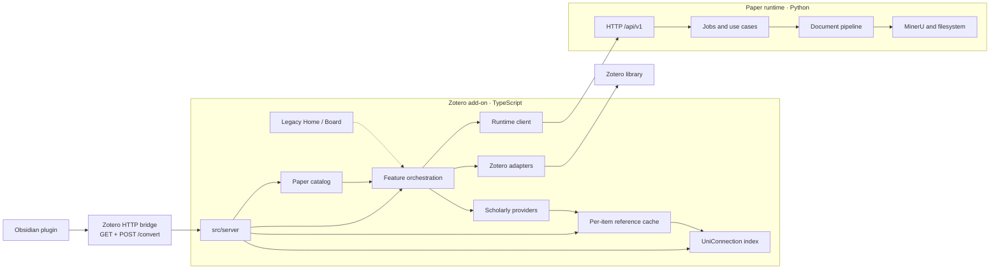

# Architecture

This document describes the architecture that exists now.

## System



**Main path:** Obsidian plugin → localhost bridge on Zotero’s HTTP server → add-on data
plane (cache, relations, Paper catalog, conversion) → Zotero items / scholarly providers /
paper runtime.

**Legacy (dashed):** Unizero Home (Project View / Board) still ships in the XPI and talks
to the same data plane through a window API bridge. It is not the product focus. Item-pane
previews and the per-paper Graph tab remain available.

Metadata, literature relations, and the Paper catalog run in the add-on. PDF conversion,
artifact publishing, and Markdown annotation injection require the local runtime.

## Add-on layers

| Layer | Current paths | Role |
| --- | --- | --- |
| Lifecycle | `src/hooks.ts`, `src/core/` | Register and clean up features per window |
| Features | `src/features/` | Commands and user-facing orchestration |
| Bridge | `src/server/` | Mostly-read-only endpoints for Obsidian (GET + `POST /convert`) |
| UI | `src/ui/`, `src/modules/views.ts` | Menus, panes, dialogs, progress |
| Dialog content | `addon/chrome/content/` | Privileged XHTML: panel, **legacy** Home, graph renderer |
| Zotero adapters | `src/zotero/` | Read and mutate Zotero items and attachments |
| Providers | `src/modules/*Api.ts`, `src/modules/resolve.ts` | Scholarly HTTP access and normalization |
| Cache | `src/modules/localStorage.ts`, `src/modules/literatureCache.ts` | Per-item shards under the add-on data directory |
| Derived index | `src/modules/uniConnection.ts`, `src/modules/uniConnectionSync.ts` | Reverse-reference index, coupling, graph topology |
| Projects / catalog | `src/projects/` | Portable Project identity, Paper catalog, local object persistence |
| Runtime boundary | `src/runtime-client/` | Contract types, HTTP, launch, process state |

`src/modules/` contains the established item-pane, metadata, provider, and cache
implementation. New code uses the more specific directories above. Existing modules are
split only when the work being done needs that boundary.

Feature IDs are statically registered in `src/core/features.ts`:

- `library.metadata`;
- `literature.relations`;
- `document.convert`;
- `annotations`.

Static registration keeps activation and cleanup auditable in Zotero’s multi-window
environment. The derived index (and legacy Home) belong to `literature.relations`.

## Bridge contract

The Obsidian plugin never holds a second bibliographic store. It calls endpoints on
Zotero’s existing loopback HTTP server (`BRIDGE_API_VERSION` in
`apps/zotero-addon/src/server/bridgePayloads.ts`).

Load-bearing properties:

- **Mostly read-only.** GET endpoints never mutate Zotero or the Paper catalog. The sole
  write-shaped exception is `POST /convert`, which starts the same conversion job as the
  Zotero item menu. Bibliographic edits, Paper-catalog writes, and exploration import
  need a separate write-back design.
- **No unrequested provider traffic.** Relations answer from cache. A miss is
  `loaded: false` so the caller can prompt; only explicit `fetch=1` may hit the network.
  Rendering a note must never start conversion or provider work.
- **Identity.** Persisted citations use `libraryID` + `itemKey`. A citekey is a derived
  alias and may collide; ambiguity is reported, never resolved silently.

This boundary is unrelated to the add-on ↔ runtime `/api/v1` contract. Do not merge them.

## Paper catalog

The catalog is stored under `<dataDir>/unizero/literature/`. A Zotero binding uses portable
library scope plus item key, so refreshing metadata never replaces a Paper ID. Dropping an
out-of-library result creates or reuses an identifier-aliased Paper without creating a
Zotero item; a later Zotero-bound observation with a matching identifier adds a binding
to that same Paper.

Loading a References or Citations snapshot materializes every result at `cache` retention,
and retention only ever climbs:

```text
cache → pinned → zotero
```

Reliable DOI, arXiv, Semantic Scholar, and OpenAlex aliases converge provider results.
An unidentified result gets a query-scoped provisional mapping keyed by bibliographic
fingerprint rather than by list position. Where an alias set resolves to more than one
Paper, identifier inspection reports the conflict rather than silently picking one;
an explicit merge chooses the canonical Paper and leaves a `paper-redirect`.

The same snapshot writes `LiteratureCitationObservation` documents: References records
`seed → result`, Citations records `result → seed`, with provider, query kind, retrieval
time, and source order on the observation. Only a successful terminal snapshot may replace
older observations for the same seed, query kind, and provider. After a replacement,
cache-only Papers with no remaining observation are collected; pinned and Zotero-bound
Papers never are.

## Derived relations index

`UniConnection` is a derived layer. It owns no truth: everything it holds is recomputed
from the per-item `References-Resolved-v4` caches and from item identifiers, so it can be
discarded and rebuilt at any time.

One reverse index answers every query it serves — the Relation tab, bibliographic
coupling, topology used by the per-paper Graph tab, Board relation hints, and (via the
bridge) Obsidian’s detail pane — so a change to how edges are stored affects all
consumers. Topology is memoized per library and invalidated by build, ingest, retract,
trash, and delete.

Rules this layer keeps:

- **Edges need a stable identity.** `edgeIdentity` yields `doi:` / `arxiv:` / `s2:` keys;
  a reference without one is skipped rather than keyed by title.
- **Topology carries no Zotero fields.** `GraphNode` holds `id`, `itemKey`, `degree`, and
  `isCenter` only. Display fields are added afterwards by `views.getLiteratureGraph`.
- **The index spans all edges, not just library members.** Library filtering happens at
  query time.
- **Bulk builds read shards directly**, bypassing the cache’s small resident set.
- **Maintenance is incremental.** `uniConnectionSync` registers a Zotero notifier.
- **Reference writes are ordered before topology reads.** A References refresh awaits the
  cache write and `ingestItem` before the bridge resolves.

Design detail: [UNICONNECTION.md](UNICONNECTION.md).

## Sync (Project documents)

Project documents sync through a backend-neutral engine using per-device manifests and
immutable packs. The WebDAV adapter owns only HTTPS, Basic authorization, collections, and
conditional requests. A process-wide scheduler runs after a delayed startup and then at a
user-selected interval of 30 minutes or longer.

Three rules keep a device from being stranded or misreported:

- **A run that reports remaining work is a continuation, not a result.** Large first
  syncs span several runs; the scheduler retries promptly; neither claims success
  mid-transfer.
- **An unknown namespace is skipped, never fatal.** The checkpoint records skipped packs
  so a build that registers the namespace can replay them.
- **Content addressing is locale-independent.** Checksums use code-unit ordering and
  invariant case folding.

Credentials are device-local (Login Manager under the WebDAV origin and an add-on-specific
realm). No credential enters a typed document, pack, checkpoint, or log. Design notes and
unimplemented Literature namespaces: [SYNC_AND_LITERATURE_SOURCES.md](SYNC_AND_LITERATURE_SOURCES.md).

## Runtime layers

| Layer | Path | Role |
| --- | --- | --- |
| Transport | `api/` | Validate and map HTTP requests and responses |
| Application | `application/` | Configuration, job queue, conversion, annotations |
| Pipeline | `pipeline/` | Templates, step registry, transforms, publishing |
| Providers | `providers/` | Reference extraction, tables, remote enrichment |
| Composition | `composition.py` | Construct dependencies without import-time work |

The runtime keeps mutable state outside the installed package. `paths.py` resolves a
single runtime home containing configuration, work files, generated state, user
templates, and logs.

## Boundary

The add-on sends typed requests to `/api/v1`; the runtime returns typed responses and
capabilities. The shared field contract is
`packages/contracts/http/v1.schema.json`, mirrored by TypeScript and Pydantic models.

During conversion, `transform.references` reads MinerU’s untouched content list before
Markdown cleanup removes the bibliography. The runtime returns ordered local extraction
records only; the add-on persists them in the owned, versioned `ZoMiner References` JSON
attachment. Provider matching and library resolution remain add-on responsibilities.

Dependency direction:

```text
Obsidian plugin → localhost bridge → add-on features / cache / catalog

add-on UI → feature orchestration → Zotero/provider/runtime ports

legacy dialog content → window API bridge → views → cache/derived index

runtime API → application services → pipeline/providers → filesystem/MinerU
```

Neither component reaches through an HTTP boundary to reuse the other’s implementation.

## Data ownership

| Data | Owner |
| --- | --- |
| Bibliographic fields and item relations | Zotero items |
| Stable library/external paper identity and Zotero bindings | UniZero Paper catalog |
| Project identity, Board objects and paper-node layout | Versioned Project documents |
| Object merge, local checkpoint, manifest, and pack semantics | Sync engine |
| HTTPS, Basic authorization, WebDAV collections, and ETags | WebDAV backend |
| Highlight and underline annotations | Zotero attachment annotations |
| Provider responses | Refreshable add-on cache, one shard per item |
| Reverse-reference index, coupling, graph topology | Derived from the reference cache; rebuildable, never authoritative |
| Graph layout coordinates | `<dataDir>/unizero/graph/<libraryID>.json`, versioned and discardable |
| Graph display and force settings | `<dataDir>/unizero/graph/settings.json` |
| Conversion templates and jobs | Paper runtime |
| Work files and processing records | Runtime home |
| Published Markdown | User-selected filesystem destination |
| Extracted PDF bibliography | Versioned `ZoMiner References` Zotero JSON attachment |
| Note identity (`uid` frontmatter) | Published Markdown; the runtime supplies a stable default |
| Zotero item ↔ Obsidian URL binding | `<dataDir>/unizero/markdown-links/<libraryID>.json` |
| Generated Zotero attachment identity | `unizero:<kind>` tags |

Derived data never becomes a second authority for Zotero metadata. Layout coordinates sit
outside the shard tree on purpose: shards are keyed by item and swept when an item
disappears, which would delete a library-scoped file on every start.

The Markdown link registry contains no bibliographic fields or absolute paths. It joins
the canonical Zotero item identity to one user-editable `obsidian://` URL. Conversion
creates a missing binding from the configured vault and stable uid; an existing edited
URL survives re-conversion.

## Identity and safety

- Item-scoped keys include both `libraryID` and item key.
- Group-library requests carry an explicit Zotero library scope.
- Generated attachments are matched by `unizero:<kind>` tags, not titles.
- Existing user-authored attachments are not overwritten merely because their titles
  resemble generated artifacts.
- Registrations are released on window unload or add-on shutdown, including the derived
  index’s notifier observer.

## Legacy surfaces (Home / Board / Graph)

Opening Unizero Home for a Collection ensures one stable Project and one default Board,
keyed by portable library scope plus Collection key — not numeric `libraryID` /
`collectionID`. Project and Board are separate schema-versioned documents under
`<dataDir>/unizero/projects/`. Board nodes and manual edges are independent documents;
camera is transient window state.

Home is a privileged XHTML dialog (`literature-explorer.js` + `literature-graph.js`),
not part of the TypeScript bundle. It reaches the add-on only through
`window.arguments[0]`. Rules that still matter when touching that code:

- Every async result belongs to exactly one owner (tab / generation / request).
- Board render and interaction are separate — a refresh mid-gesture defers rebuild.
- Every force-graph callback passes through `guard()`.
- Saved layout coordinates need matching `GRAPH_LAYOUT_VERSION` and force signature.

Maintenance detail: [LEGACY_HOME.md](LEGACY_HOME.md). Graph force traps:
[UNICONNECTION.md](UNICONNECTION.md).

Unfinished architecture work is listed in [ROADMAP.md](ROADMAP.md), not in this current
state description.
