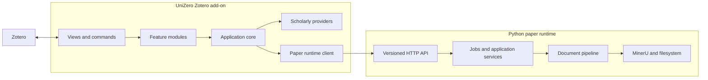

# Architecture

This document defines UniZero's target architecture. It does not claim that the target
has already been implemented.

## System shape

UniZero consists of one Zotero add-on and one optional local paper runtime.



The add-on remains useful when the local runtime is not installed: metadata completion
and scholarly-relations lookup do not require MinerU. Document conversion and Markdown
annotation mutation require the runtime.

## Module model

### Feature modules

Feature modules are user-facing Zotero capabilities and are statically registered by
the add-on.

Initial modules:

| Module ID | Responsibility |
| --- | --- |
| `library.metadata` | Resolve, compare, review, and apply bibliographic metadata |
| `literature.relations` | References, citations, import, and Zotero relations |
| `document.convert` | Conversion commands, runtime jobs, and artifact registration |
| `annotations` | Collect, render, export, and incrementally inject annotations |

A feature module may contribute commands, item-pane sections, preferences, and
application services. It must have symmetric activation and deactivation.

Runtime loading of third-party executable modules is not a first-release goal. A static
registry gives type safety and makes Zotero lifecycle cleanup auditable.

### Providers

Providers implement data or computation ports without owning UI.

Examples:

- Zotero item and attachment access;
- Crossref metadata and bibliographic search;
- OpenAlex references, citations, and abstracts;
- Semantic Scholar identity and relations;
- MinerU document extraction;
- Markdown-directory or Obsidian publishing.

Provider results must retain provenance and, where relevant, retrieval time and
confidence.

### Pipeline steps

Pipeline steps run inside the Python document runtime. The existing ZoMiner roles
remain useful within this scope:

- prepare;
- extract;
- process;
- publish.

Pipeline steps consume and produce typed artifacts. Future validation should use
declared inputs and outputs in addition to ordering roles. The global UniZero feature
registry must not inherit the rule that every workflow needs one Extract and one
Publish step.

## Data ownership

| Data | Canonical owner | Notes |
| --- | --- | --- |
| Bibliographic metadata | Zotero item | External providers propose candidates; users review conflicts |
| Annotations | Zotero attachment annotations | Markdown output is a projection |
| References and citations | Provider cache | Derived and refreshable; imported items live in Zotero |
| Conversion templates | Paper runtime | Built-ins plus user overrides |
| Layout and extraction data | Paper runtime store | Machine-local, not committed |
| Published Markdown | User-selected destination | A living document, not a metadata authority |
| Artifact registrations | UniZero add-on | Identified by explicit schema and source keys |

Citation counts are volatile derived data. If exported, they include provider and
retrieval time and are not treated as timeless Zotero metadata.

## Metadata flow

```text
Zotero snapshot
    ↓
identity resolution
    ↓
provider candidates with provenance
    ↓
field-level comparison and conflict review
    ↓
single Zotero transaction
    ↓
fresh snapshot for conversion/frontmatter
```

Identity resolution happens before field merging. UniZero must not combine fields from
different works merely because their titles are similar.

The initial merge policies are:

- fill missing fields;
- review conflicts;
- overwrite only explicitly selected fields.

The current Zoference identifier completion becomes the first slice of this module, not
the definition of complete metadata support.

## Frontmatter projection

The document runtime receives a versioned Zotero item snapshot. Frontmatter templates
select and rename values from that snapshot:

```yaml
frontmatter:
  fields:
    - from: item.title
      to: title
    - from: item.creators.authors
      to: authors
    - from: item.DOI
      to: doi
    - from: context.citekey
      to: citekey
    - from: links.zoteroItem
      to: zotero
  static:
    tags: [paper]
  omit_empty: true
```

This replaces hard-coded bibliographic output with a controlled projection while
retaining runtime-only values such as local PDF path and Zotero deep links.

## Runtime contract

The add-on and runtime communicate only through a versioned localhost HTTP API.

The next contract must use nested snapshots rather than continuously extending a flat
conversion request:

```text
request
├── item
│   ├── libraryID
│   ├── key and itemType
│   ├── fields
│   └── creators and tags
├── attachment
│   ├── key, title, and local path
│   └── supplement status
├── context
│   ├── citekey
│   └── Zotero links
└── template and options
```

Breaking changes require a new API version or explicit capability negotiation. A new
add-on must fail clearly against an incompatible stale runtime.

## Artifacts

Artifacts are identified by data, not by display title.

The common artifact envelope includes:

- schema version;
- artifact kind;
- producer module and producer version;
- source `libraryID`, item key, and attachment key;
- generation time;
- content type;
- local path or Zotero attachment identity;
- optional content fingerprint.

Initial artifact kinds include Markdown, table summary, extracted references, layout
content list, and annotation export.

The legacy `zominer.references/1` attachment remains a readable compatibility format
during migration. Once a conversion job returns extracted references directly, the
attachment may remain as a durable/exportable artifact but is no longer the only
communication mechanism between features.

## Annotation model

The normalized annotation snapshot includes:

- key and attachment key;
- annotation type and color;
- text and comment;
- page label and sort index;
- optional tags.

Rendering is separate from collection. Profiles can map type and color to Markdown,
HTML, callouts, or custom templates.

Initial output modes:

- inline injection into matched body text;
- a managed annotations section;
- a standalone annotations document.

Inline mutation remains append-only by default. Managed sections and standalone
documents use stable annotation markers so changed comments can be updated
idempotently.

## Cache rules

- Cache keys include `libraryID` and item key.
- Provider, query identity, schema version, and relevant settings are part of the key.
- Transient errors are never permanent negative results.
- Citation data has a time-to-live.
- Writes are serialized and resolve only after persistence.
- Cache files are machine-local and contain no telemetry.

