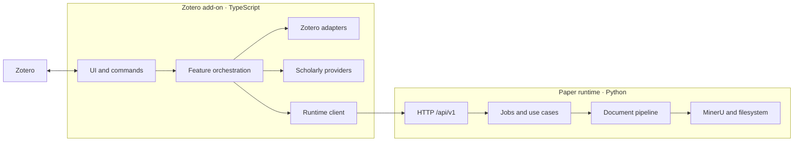

# Architecture

This document describes the architecture that exists now.

## System



Metadata and literature-relations features run entirely in the add-on. PDF conversion,
artifact publishing, and Markdown annotation injection require the local runtime.

## Add-on layers

| Layer | Current paths | Role |
| --- | --- | --- |
| Lifecycle | `src/hooks.ts`, `src/core/` | Register and clean up features per window |
| Features | `src/features/` | Commands and user-facing orchestration |
| UI | `src/ui/`, `src/modules/views.ts` | Menus, panes, dialogs, progress |
| Zotero adapters | `src/zotero/` | Read and mutate Zotero items and attachments |
| Providers | `src/modules/*Api.ts`, `src/modules/resolve.ts` | Scholarly HTTP access and normalization |
| Runtime boundary | `src/runtime-client/` | Contract types, HTTP, launch, process state |

`src/modules/` contains the established item-pane, metadata, provider, and cache
implementation. New code uses the more specific directories above. Existing modules are
split only when the work being done needs that boundary.

Feature IDs are statically registered in `src/core/features.ts`:

- `library.metadata`;
- `literature.relations`;
- `document.convert`;
- `annotations`.

Static registration keeps activation and cleanup auditable in Zotero's multi-window
environment.

## Runtime layers

| Layer | Path | Role |
| --- | --- | --- |
| Transport | `api/` | Validate and map HTTP requests and responses |
| Application | `application/` | Configuration, job queue, conversion, annotations |
| Pipeline | `pipeline/` | Templates, step registry, transforms, publishing |
| Providers | `providers/` | Reference extraction, tables, remote enrichment |
| Composition | `composition.py` | Construct dependencies without import-time work |

The runtime keeps mutable state outside the installed package. `paths.py` resolves a
single runtime home containing configuration, work files, generated state, user
templates, and logs.

## Boundary

The add-on sends typed requests to `/api/v1`; the runtime returns typed responses and
capabilities. The shared field contract is
`packages/contracts/http/v1.schema.json`, mirrored by TypeScript and Pydantic models.

Dependency direction:

```text
add-on UI → feature orchestration → Zotero/provider/runtime ports

runtime API → application services → pipeline/providers → filesystem/MinerU
```

Neither component reaches through the HTTP boundary to reuse the other's implementation.

## Data ownership

| Data | Owner |
| --- | --- |
| Bibliographic fields and item relations | Zotero items |
| Highlight and underline annotations | Zotero attachment annotations |
| Provider responses | Refreshable add-on cache |
| Conversion templates and jobs | Paper runtime |
| Work files and processing records | Runtime home |
| Published Markdown | User-selected filesystem destination |
| Generated Zotero attachment identity | `unizero:<kind>` tags |

Derived data never becomes a second authority for Zotero metadata.

## Identity and safety

- Item-scoped keys include both `libraryID` and item key.
- Group-library requests carry an explicit Zotero library scope.
- Generated attachments are matched by `unizero:<kind>` tags, not titles.
- Existing user-authored attachments are not overwritten merely because their titles
  resemble generated artifacts.
- Registrations are released on window unload or add-on shutdown.

Unfinished architecture work is listed in [ROADMAP.md](ROADMAP.md), not in this current
state description.
