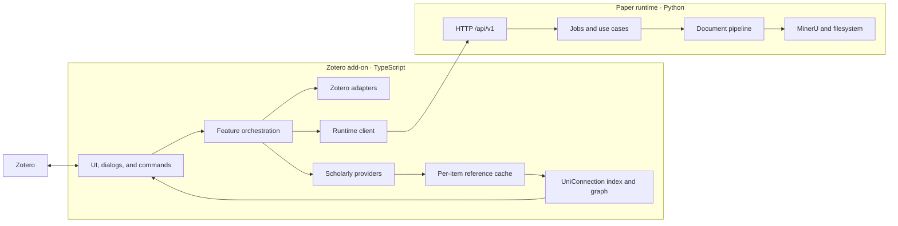

# Architecture

This document describes the architecture that exists now.

## System



Metadata, literature-relations, and graph features run entirely in the add-on. PDF
conversion, artifact publishing, and Markdown annotation injection require the local
runtime.

## Add-on layers

| Layer | Current paths | Role |
| --- | --- | --- |
| Lifecycle | `src/hooks.ts`, `src/core/` | Register and clean up features per window |
| Features | `src/features/` | Commands and user-facing orchestration |
| UI | `src/ui/`, `src/modules/views.ts` | Menus, panes, dialogs, progress |
| Dialog content | `addon/chrome/content/` | Privileged XHTML windows: panel, Literature Explorer, graph renderer |
| Zotero adapters | `src/zotero/` | Read and mutate Zotero items and attachments |
| Providers | `src/modules/*Api.ts`, `src/modules/resolve.ts` | Scholarly HTTP access and normalization |
| Cache | `src/modules/localStorage.ts`, `src/modules/literatureCache.ts` | Per-item shards under the add-on data directory |
| Derived index | `src/modules/uniConnection.ts`, `src/modules/uniConnectionSync.ts` | Reverse-reference index, coupling, graph topology |
| Runtime boundary | `src/runtime-client/` | Contract types, HTTP, launch, process state |

`src/modules/` contains the established item-pane, metadata, provider, and cache
implementation. New code uses the more specific directories above. Existing modules are
split only when the work being done needs that boundary.

Feature IDs are statically registered in `src/core/features.ts`:

- `library.metadata`;
- `literature.relations`;
- `document.convert`;
- `annotations`.

Static registration keeps activation and cleanup auditable in Zotero's multi-window
environment. The derived index and the Literature Explorer belong to
`literature.relations`, which also owns the index's Zotero notifier registration.

## Derived relations index

`UniConnection` is a derived layer. It owns no truth: everything it holds is recomputed
from the per-item `References-Resolved-v4` caches and from item identifiers, so it can be
discarded and rebuilt at any time.

| Structure | Meaning |
| --- | --- |
| `inverted: EdgeKey → Set<ScopedItemKey>` | Which library papers cite this reference |
| `forward: ScopedItemKey → Set<EdgeKey>` | Which references a library paper declares |
| `selfEdge` / `edgeOwner` | A library paper's own identity edge, and its inverse |

One index answers both queries: `relationsOf(item)` reads `inverted` at the item's own
edge; `coupledWith(item)` walks `forward` then `inverted` and tallies shared references.
`libraryGraph(libraryID, options)` derives whole-library topology from the same structures
and memoizes it per library and effective option set. Build, ingest, retract, trash, and
delete invalidate that library's memoized topology.

Rules this layer keeps:

- **Edges need a stable identity.** `edgeIdentity` yields `doi:` / `arxiv:` / `s2:` keys;
  a reference without one is skipped rather than keyed by title, which would silently
  merge distinct papers.
- **Topology carries no Zotero fields.** `GraphNode` holds `id`, `itemKey`, `degree`, and
  `isCenter` only. Titles, years, and citation counts are added afterwards by
  `views.getLiteratureGraph`, from the same source as the Collection snapshot. This keeps
  the index host-independent and unit-testable.
- **The index spans all edges, not just library members.** Two library papers can be
  coupled through a reference neither of them is. Library filtering happens at query
  time.
- **Bulk builds read shards directly**, bypassing the cache's small resident set, so a
  full-library scan cannot evict the interactive working set.
- **Maintenance is incremental.** `uniConnectionSync` registers a Zotero notifier;
  add/modify retracts and re-ingests an item, delete and trash retract it. Items without
  a reference cache are filled by a throttled, deduplicated queue that reuses
  `referencesApi` and its provider rate gate.
- **Reference writes are ordered before topology reads.** A References refresh awaits the
  cache write and `ingestItem` before the bridge resolves. Citations only update status,
  while Markdown conversion patches live node metadata without rebuilding topology.

Design detail and the reasoning behind these constraints are in
[UNICONNECTION.md](UNICONNECTION.md); the graph views are in
[UNICONNECTION_GRAPH.md](UNICONNECTION_GRAPH.md).

## Graph rendering

The Literature Explorer is a privileged XHTML dialog, not part of the TypeScript bundle.
It reaches the add-on only through the plain-object API passed as `window.arguments[0]`.

- `literature-explorer.js` owns view state, filtering, tables, and the detail tabs.
  Papers open as window tabs, but only one detail view exists in the DOM. `TabState` owns
  the item/kind, snapshot, busy and request generations, raw graph, detail graph filters,
  search/year filters, and scroll position. Switching projects that state into the shared
  DOM. Every asynchronous operation captures its context generation, tab reference,
  item key, kind, and request generation; completion may update only that owner, and may
  update the live DOM only while the owner is active.
- A context reload increments the context generation, destroys both simulations, cancels
  refit/settings timers and settle listeners, and drops library-scoped data/layout state.
  Collection filters and each paper tab's graph filters are independent.
- `literature-graph.js` owns force simulation and canvas drawing, and consumes only the
  plain `LiteratureGraph` structure, so the renderer can be replaced without touching the
  data layer.
- A detail graph is not a one-hop topology. The bridge's `focusedGraph` endpoint asks
  `views.getLiteratureFocusedGraph` for the same complete scoped graph as Collection,
  marks the selected node, and centres the renderer on it.
- `vendor/force-graph.min.js` is a vendored MIT build. Dialog content is fully local; no
  CDN or external fetch is permitted.

Two constraints are load-bearing and easy to break:

- Every callback handed to force-graph runs synchronously inside its animation loop, and
  that loop has no error handling. An unguarded throw stops rendering permanently. All
  callbacks pass through `guard()`, swallowed failures surface on the graph status line,
  and a watchdog restarts a stalled loop.
- Saved layout coordinates are only meaningful at the scale of the forces that produced
  them, so the layout file carries two guards: `GRAPH_LAYOUT_VERSION` for changes made in
  code, and a force signature for the settings the user chose. Either mismatch is a cold
  start. Reads and writes also discard non-finite coordinates and node IDs outside the
  current `${libraryID}:` namespace; writes for the same library are serialized.
- Display and force settings live in the renderer, which owns their meaning, their
  bounds, and their sanitisation; the layers below only carry them to and from disk.

The host-independent dialog harness loads the real XHTML and plain JavaScript under
`happy-dom`. It covers tab/context races, graph ownership, per-tab filters, settle/refit
lifecycle, geometry callbacks, error recovery, and layout serialization. Privileged
Zotero APIs and the real force-graph canvas remain manual checks.

## Runtime layers

| Layer | Path | Role |
| --- | --- | --- |
| Transport | `api/` | Validate and map HTTP requests and responses |
| Application | `application/` | Configuration, job queue, conversion, annotations |
| Pipeline | `pipeline/` | Templates, step registry, transforms, publishing |
| Providers | `providers/` | Reference extraction, tables, remote enrichment |
| Composition | `composition.py` | Construct dependencies without import-time work |

The runtime keeps mutable state outside the installed package. `paths.py` resolves a
single runtime home containing configuration, work files, generated state, user
templates, and logs.

## Boundary

The add-on sends typed requests to `/api/v1`; the runtime returns typed responses and
capabilities. The shared field contract is
`packages/contracts/http/v1.schema.json`, mirrored by TypeScript and Pydantic models.

Dependency direction:

```text
add-on UI → feature orchestration → Zotero/provider/runtime ports

add-on dialog content → window API bridge → views → cache/derived index

runtime API → application services → pipeline/providers → filesystem/MinerU
```

Neither component reaches through the HTTP boundary to reuse the other's implementation.

## Data ownership

| Data | Owner |
| --- | --- |
| Bibliographic fields and item relations | Zotero items |
| Highlight and underline annotations | Zotero attachment annotations |
| Provider responses | Refreshable add-on cache, one shard per item |
| Reverse-reference index, coupling, graph topology | Derived from the reference cache; rebuildable, never authoritative |
| Graph layout coordinates | `<dataDir>/unizero/graph/<libraryID>.json`, versioned and discardable |
| Graph display and force settings | `<dataDir>/unizero/graph/settings.json`, one file for every library |
| Conversion templates and jobs | Paper runtime |
| Work files and processing records | Runtime home |
| Published Markdown | User-selected filesystem destination |
| Note identity (`uid` frontmatter) | Published Markdown; the runtime supplies a stable default |
| Zotero item ↔ Markdown note binding | `<dataDir>/unizero/markdown-links/<libraryID>.json`, maintained by the add-on |
| Generated Zotero attachment identity | `unizero:<kind>` tags |

Derived data never becomes a second authority for Zotero metadata. Layout coordinates sit
outside the shard tree on purpose: shards are keyed by item and swept when an item
disappears, which would delete a library-scoped file on every start.

The Markdown link registry contains no bibliographic fields. It joins the canonical
Zotero item and attachment identity to the path and frontmatter uid observed in the
published file. Conversion, an explicit link change, or observing a reachable changed
file refreshes it; observation never rewrites an existing absolute-path attachment.

## Identity and safety

- Item-scoped keys include both `libraryID` and item key.
- Group-library requests carry an explicit Zotero library scope.
- Generated attachments are matched by `unizero:<kind>` tags, not titles.
- Existing user-authored attachments are not overwritten merely because their titles
  resemble generated artifacts.
- Registrations are released on window unload or add-on shutdown, including the derived
  index's notifier observer.

Unfinished architecture work is listed in [ROADMAP.md](ROADMAP.md), not in this current
state description.
